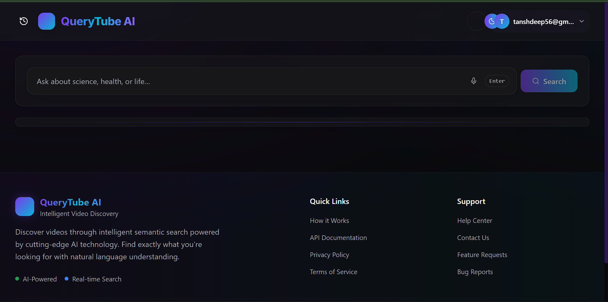
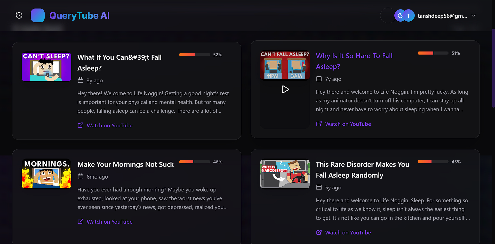

# QueryTube-AI 🎥

<div align="center">


A modern YouTube video search application powered by AI 🚀

[Live Demo](query-tube-ai.vercel.app/) 



</div>

---

## ✨ Features

- 🔍 **AI-Powered Search**: Intelligent video search using advanced algorithms
- 🎨 **Modern UI**: Clean and responsive interface built with React and Tailwind CSS
- 🌙 **Dark Mode**: Toggle between light and dark themes
- ⚡ **Fast Performance**: Built with Vite for lightning-fast development and production
- 🔒 **Secure**: Backend powered by FastAPI with secure API endpoints

## 🛠️ Tech Stack

### Frontend
- **React** - UI Framework
- **Vite** - Build Tool
- **Tailwind CSS** - Styling
- **React Context** - State Management

### Backend
- **FastAPI** - API Framework
- **Python** - Backend Language
- **Sentence Transformers** - AI Model for Search

## 🚀 Getting Started

### Prerequisites
- Node.js (v16 or higher)
- Python 3.9+
- npm or yarn

### Installation

1. Clone the repository
```bash
git clone https://github.com/Thakur0088/QueryTube-AI.git
cd QueryTube-AI
```

2. Install frontend dependencies
```bash
npm install
```

3. Install backend dependencies
```bash
cd Server
pip install -r requirements.txt
```

4. Start the development servers

Frontend:
```bash
npm run dev
```

Backend:
```bash
cd Server
uvicorn app:app --reload
```

## 📸 Screenshots

<div align="center">
  
  
</div>

## 🌟 Usage

1. Enter your search query in the search bar
2. Browse through the AI-enhanced search results
3. Click on a video to view details
4. Toggle dark mode using the theme switcher


## 🚀 Deployment

### Frontend (Vercel)
1. Connect your GitHub repository to Vercel
2. Set the build command to `npm run build`
3. Set the output directory to `dist`

### Backend
Deploy the FastAPI backend to your preferred hosting platform (Heroku, AWS, etc.)

## 🤝 Contributing

1. Fork the repository
2. Create a new branch (`git checkout -b feature/amazing-feature`)
3. Commit your changes (`git commit -m 'Add amazing feature'`)
4. Push to the branch (`git push origin feature/amazing-feature`)
5. Open a Pull Request

## 📜 License

This project is licensed under the MIT License - see the [LICENSE](LICENSE) file for details.

## 👨‍💻 Author

**Your Name**
- GitHub: [@Thakur0088](https://github.com/Thakur0088)
- LinkedIn: [Anshdeep Thakur](https://www.linkedin.com/in/anshdeep-thakur-a6b8b728b/)

---

<div align="center">
If you found this project helpful, please consider giving it a ⭐️
</div>
